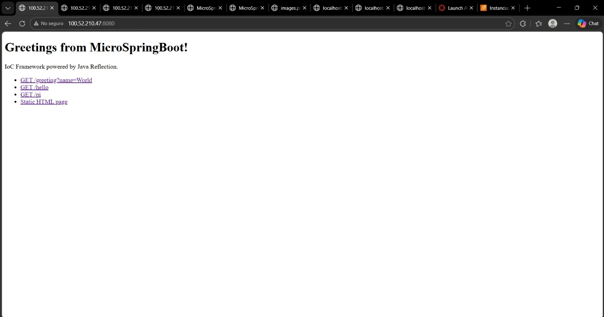
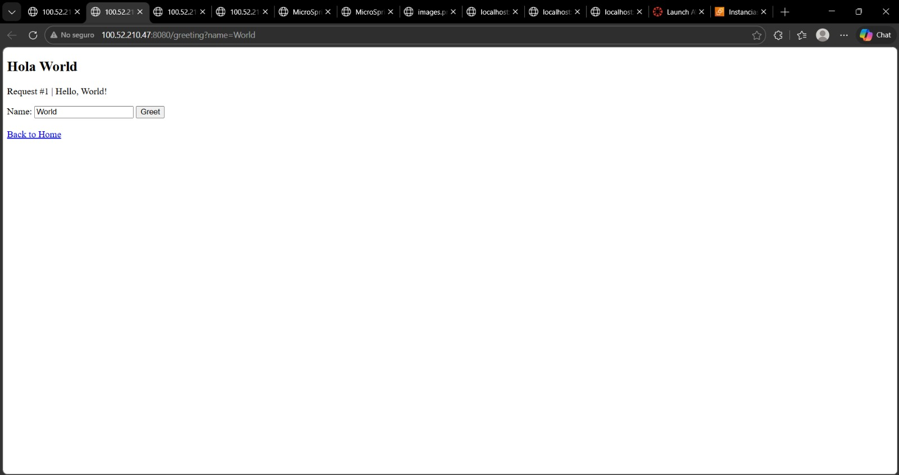
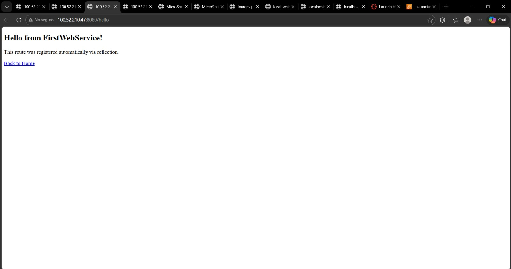
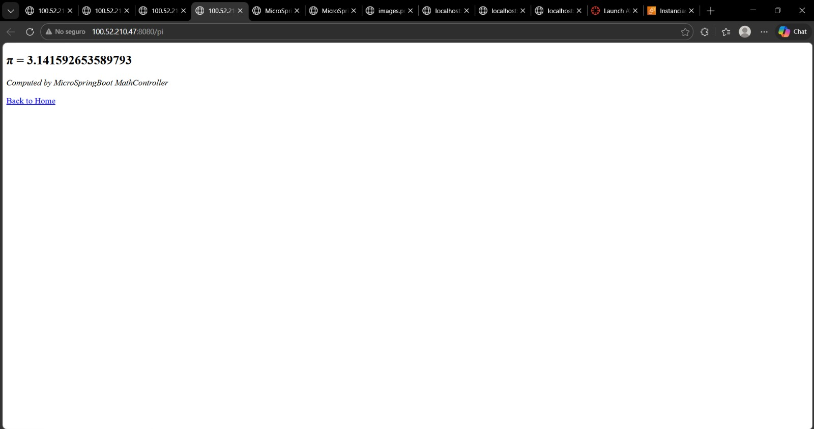
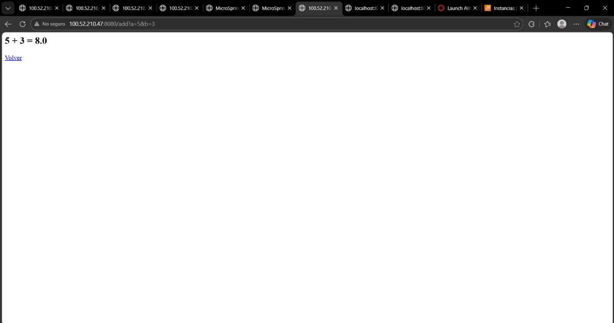
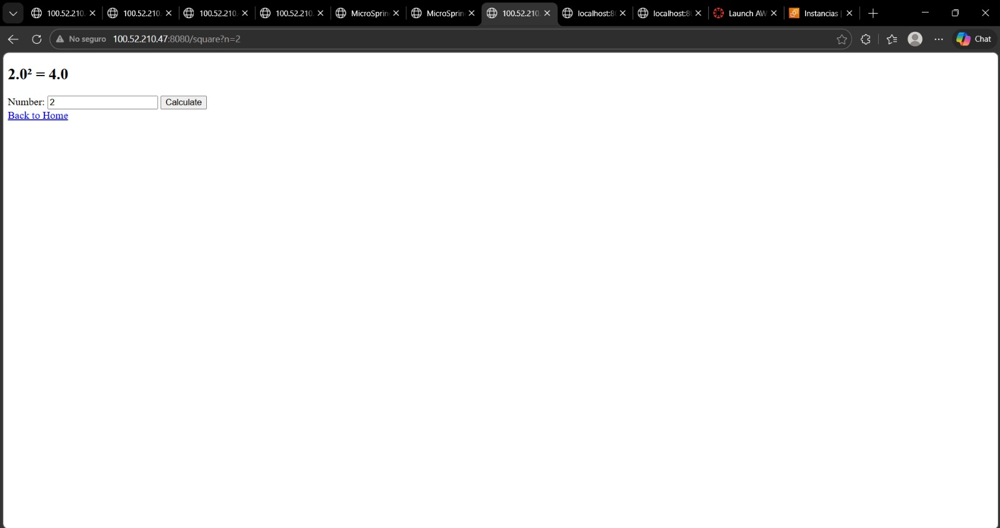
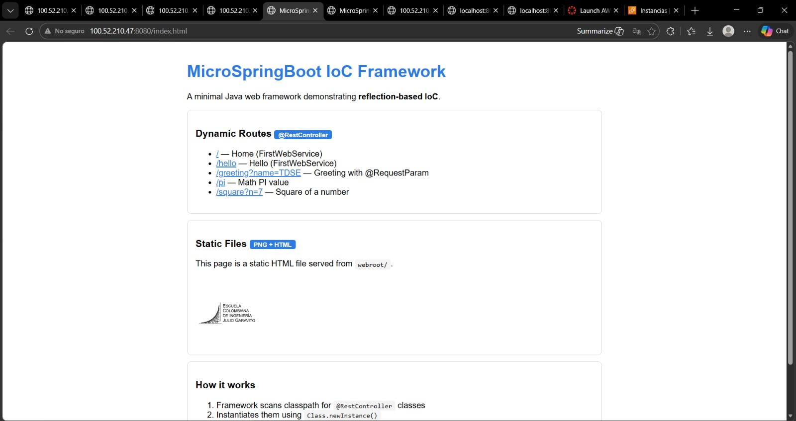
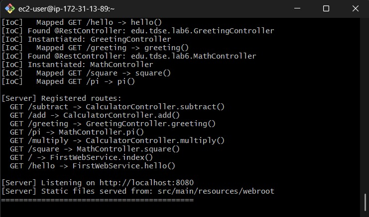

# MicroSpringBoot — IoC Web Framework

A minimal Java web server with an IoC framework that uses reflection to load POJOs as web components. The server delivers HTML pages and PNG images, and allows building web applications from plain Java objects annotated with `@RestController`, `@GetMapping`, and `@RequestParam` — similar to how Spring Boot works under the hood.

## Getting Started

These instructions will get you a copy of the project up and running on your local machine for development and testing purposes. See [deployment](#deployment) for notes on how to deploy the project on a live system.

### Prerequisites

What you need to install the software and how to install them:

**Java 11 or higher**
```
https://www.oracle.com/java/technologies/javase-downloads.html
```
Verify installation:
```bash
java -version
```

**Apache Maven 3.6 or higher**
```
https://maven.apache.org/download.cgi
```
Verify installation:
```bash
mvn -version
```

---

### Installing

A step by step series of examples that tell you how to get a development environment running.

**Step 1 — Clone the repository**
```bash
git clone https://github.com/your-username/Arquitecturas-de-Servidores.git
cd Arquitecturas-de-Servidores
```

**Step 2 — Compile the project**
```bash
mvn clean package
```

**Step 3 — Run the server**
```bash
java -cp target/classes edu.tdse.lab6.Main
```

**Step 4 — Verify the server is running**

Open your browser and navigate to:
```
http://localhost:8080/
```

You should see the MicroSpringBoot home page with all registered routes listed.

**Step 5 — Try the greeting endpoint**
```
http://localhost:8080/greeting?name=World
```

Expected output:
```
Hola World
```

---

## Running the Tests

### End to End Tests

The framework's IoC auto-discovery can be verified by starting the server without any arguments and confirming all `@RestController` classes are loaded automatically.

**Start the server and observe console output:**
```bash
java -cp target/classes edu.tdse.lab6.Main
```









Expected output:
```
[IoC] Auto-discovering @RestController components...
[IoC] Found @RestController: edu.tdse.lab6.FirstWebService
[IoC] Found @RestController: edu.tdse.lab6.GreetingController
[IoC] Found @RestController: edu.tdse.lab6.MathController
[IoC] Found @RestController: edu.tdse.lab6.CalculatorController

[Server] Registered routes:
  GET /           -> FirstWebService.index()
  GET /greeting   -> GreetingController.greeting()
  GET /pi         -> MathController.pi()
  GET /add        -> CalculatorController.add()

[Server] Listening on http://localhost:8080
```

This test validates that reflection-based discovery, route registration, and server startup all work correctly end-to-end.

### Coding Style Tests

The project follows standard Java naming conventions and uses annotation-based configuration. Each controller must:

- Be annotated with `@RestController` at the class level
- Map routes using `@GetMapping("/path")`
- Bind query parameters using `@RequestParam(value = "param", defaultValue = "default")`

Example of a correctly structured controller:
```java
@RestController
public class GreetingController {

    @GetMapping("/greeting")
    public String greeting(@RequestParam(value = "name", defaultValue = "World") String name) {
        return "Hola " + name;
    }
}
```

---

## Deployment

To deploy on a live AWS EC2 instance:

**1. Build the executable JAR**
```bash
mvn clean package
```

**2. Transfer the JAR and static files to EC2**
```bash
sftp -i "AppServer.pem" ec2-user@100.52.210.47
```

**3. SSH into the instance and install Java**
```bash
ssh -i your-key.pem ec2-user@<EC2-PUBLIC-IP>
sudo yum install java-11-amazon-corretto -y
```

**4. Run the server**
```bash
mkdir -p src/main/resources && mv webroot src/main/resources/
java -jar microspringboot.jar
```

**5. Open port 8080 in your EC2 Security Group** (Inbound rule: Custom TCP, port 8080, source 0.0.0.0/0)

**6. Access the application**
```
http://<EC2-PUBLIC-IP>:8080/
```

---

## Built With

* **Java** - Core language and reflection API
* **Maven** - Dependency management and build lifecycle
* **ServerSocket** - Java native HTTP server (no external dependencies)

---


## Versioning

We use **SemVer** for versioning. For the versions available, see the **tags on this repository**.

---

## Authors

* Diego Rozo

See also the list of **contributors** who participated in this project.

---

## License

This project is licensed under the MIT License - see the **LICENSE.md** file for details.

---

## Acknowledgments

* Inspired by the Spring Framework's IoC container and annotation-driven configuration
* Java Reflection API documentation — Oracle
* Escuela Colombiana de Ingeniería Julio Garavito — AREP course